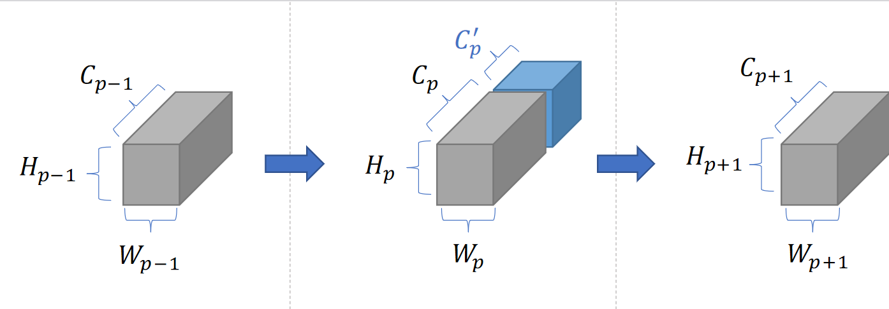

# Precipitation Nowcasting Using Grid-based Data in South Korea Region

## 1. Introduction

This repository contains Python (PyTorch) code for running model described in the paper, [Precipitation Nowcasting Using Grid-based Data in South Korea Region (ICDM 2020 Workshop)](https://ieeexplore.ieee.org/abstract/document/9346451), for LDAPS (Local Data Assimilation and Prediction System) dataset based on deep learning technology. LDAPS dataset was provided by [National Institute of Meteorogical Sciences(국립기상과학원)](http://www.nimr.go.kr/MA/main.jsp), which belongs to the [Korea Meteorogical Administrator(대한민국 기상청)](https://www.kma.go.kr/home/index.jsp). Since LDAPS is a numerical prediction model mainly used for weather forecating in KMA, this project aims to **correct** the results of LDAPS using deep learning model.

## 2. Prerequisite

The following version of Python, PyTorch, and other Python modules are required to run. Our recommendation is to **use the latest version** of following modules.

- Python 3.6 or above
- PyTorch 1.3 or above: Install it through [Anaconda](https://www.anaconda.com/)
- numpy
- torchsummary
- tqdm
- pytorch-lightning (for computing confusion matrix)
- setproctitle (not necessary)

You can install required modules other than PyTorch by running following command
```
python3 -m pip install -r requirements.txt
```

## 3. Model

Currently, it supports two models which are came from following papers

- [U-Net: Convolutional Networks for Biomedical Image Segmentation, Ronneberger et al. 2015](http://arxiv.org/abs/1505.04597)
- [Convolutional LSTM Network: A Machine Learning Approach for Precipitation Nowcasting, Shi et al. 2015](https://arxiv.org/abs/1506.04214)

Specifically, U-Net is a main driver for our forecasting model. In other words, we don't make any noticeable modification for ConvLSTM model. We've just modified ConvLSTM model to adapt to our dataset.

All the model implementations are in `model` directory.

### 3.1 U-Net

First, the **U-Net** model is used for **classification** task. Therefore, it expects following formats for input tensor: `NCHW`. Here are the meaning of each dimension.

- `N`: batch size
- `C`: # of channels (More on this below)
- `H`: # of height (=512)
- `W`: # of width (=512)

When we construct channel dimension, we have to know the structure of LDAPS dataset. LDAPS prediction model predicts weather conditions up to 48 hours in each prediction. This prediction task is performed 4 times a day at 6 hours interval (0 UTC, 6 UTC, 12 UTC, 18 UTC), so we can get following illustration.


We've mentioned that there are 4 prediction tasks in each day, but for the sake of simplicity, we only use prediction data from UTC 0. You can get more rational about this decision in the paper.

Further, each predicted hour contains several variables which represent atmospheric condition, such as estimated 1-hour precipitation, surface pressure, etc. There are so many variables in LDAPS dataset (more than 100), KMA provides 12 variables that are known to have the greatest influence on precipitation rate.

Now, when we construct 1 batch data for model, we extract 7 consecutive hours of data, and data from each hour contain 12 variables. We concatenate all of these data into channel dimensions, hence each batch has 84 (= 12 * 7) channels.

#### U-Net configuration

We follow the vanilla U-Net structure for hour model, but add one modification. Specifically, we insert a learnable layer called **topographical layer** into the U-Net model at arbitrary position and concatenate that layer to a feature map. This layer is illustrated in below figure.



And below figure is a detailed illustration of our U-Net model.


In the U-Net illustration, our topographical layer is inserted in position specified in blue arrow and box. The reason for choice of this location is provided in paper.

#### U-Net training configuration

For training configurations, it uses **NIMSCrossEntropyLoss** for loss function. It is just a cross entropy loss, but it computes **pixel-wise** loss and calculate **f1 score** and **# of correct pixels** as well. You can find it from **nims_loss.py**.

To compute the loss, we need to mention one more peculiar thing about LDAPS dataset. Since LDAPS dataset is also **prediction** data, we have to get **real** observed precipitation data elsewhere. This observed data is collected from 705 weather station in South Korea. Therefore, we extract only 705 locations corresponding to these staions from the 512 x 512 LDAPS grid. Then, to make the task be classification, we dicretize the hourly precipitation rate at 0.1 mm/hr, i.e. **[0, 0.1) as no precipitation and [0.1, ∞) as precipitation occured**.

### 3.2 ConvLSTM 

Second model that is supported is **ConvLSTM**. It is used for **regression** task, so it expects following formats for input tensor: `NSCHW`. Here are the meaning of each dimension.

- `N`: batch size
- `S`: # of targets for prediction. Specified by `target_num` argument. 
- `C`: # of channels
- `H`: # of height (=253)
- `W`: # of width (=149)

It currently uses `MSELoss` for loss function, and you can also find it from `nims_loss.py` as well.

## 4. Dataset Implementation

Our dataset implementation has following interface, and it inherits PyTorch Dataset class. Here are the interface of our `NIMSDataset` class constructor.

```python
NIMSDataset(model, reference, model_utc, window_size, root_dir, date,
            heavy_rain=False, train=True, transform=None):
```

- `model`: Which model to use. (Currently, `unet` or `convlstm`)
- `reference`: Which reference data to be used for loss computation (Currently, `aws` and `reanalysis`)
- `model_utc`: Which prediction hour is used in LDAPS data (default: 0)
- `window_size`: How many sequnces in one instance. (default: 7)
- `root_dir`: Base directory for dataset
- `date`: Range of training date described in dictionary. It has following keys. This is used for getting profer data in the dataset folder.
    - `year`
    - `start_month`
    - `start_day`
    - `end_month`
    - `end_day`
- `heavy_rain`: Change the threshold for whether precipitation occurs to 10mm/hr (default: `False`)
- `train`: If `true`, it returns training data. Otherwise, returns test data. (default: `True`)
- `transform`: Which transform to apply to the output of dataset instance (eg. ToTensor() to transform numpy array into PyTorch tensor)

## 5. Training

In the simplest form, it can be run by executing following command.
```bash
./run.sh
```

There are several argument you can specify. It can be shown as follow.
```
python3 train.py --help
```

While training, the statistics for one epoch will be printed. It is managed by `NIMSLogger` class in `nims_logger.py`. It supports saving trainig logs as well as printing to the console.

After finishing the trainig, the trained model will be saved in `trained_model` directory. Its name is specified by the `experiment_name` in the `train.py`.

## 6. Testing

For testing, you must use trained model in the `trained_model` directory. For this, `test.py` script will prompt you to select which model to test. You have to specify only GPU index and dataset for testing for running script. Other arguments will be automatically read through name of the trained model.

```
python3 test.py --device=0 --dataset_dir=/root/to/ldaps_dataset
```